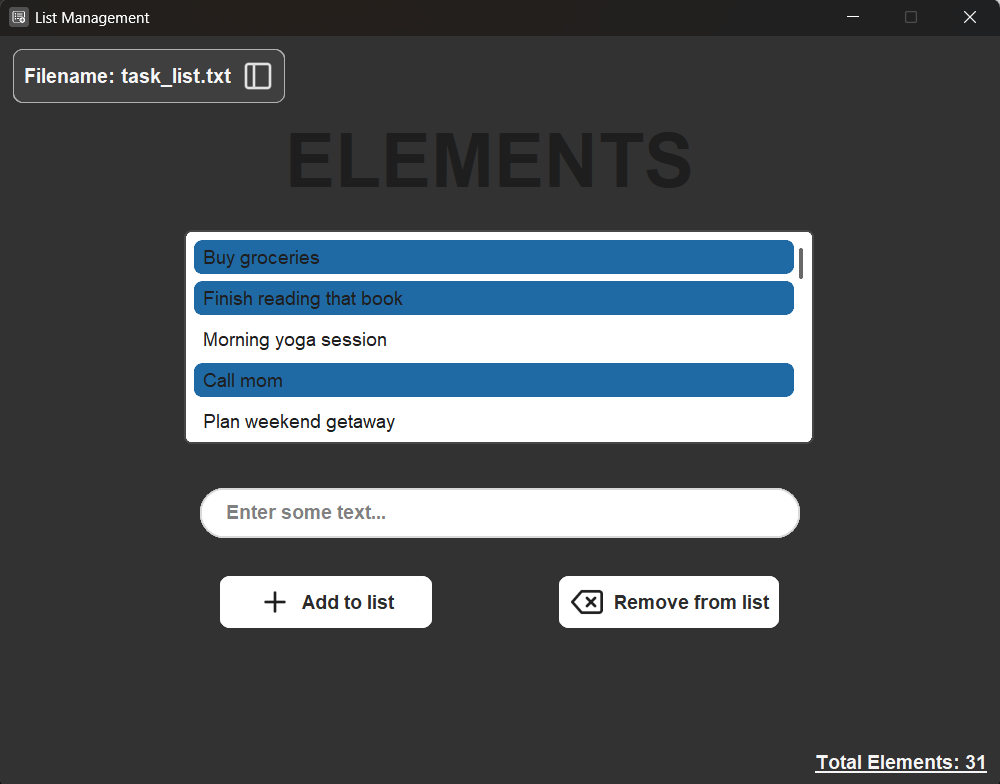
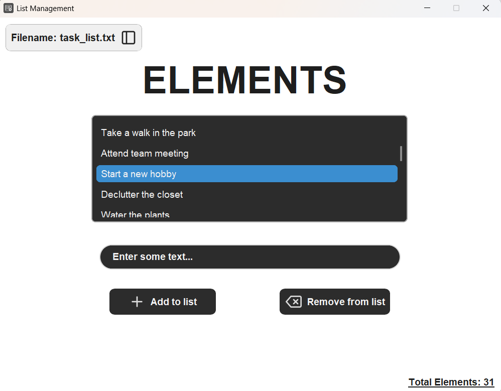
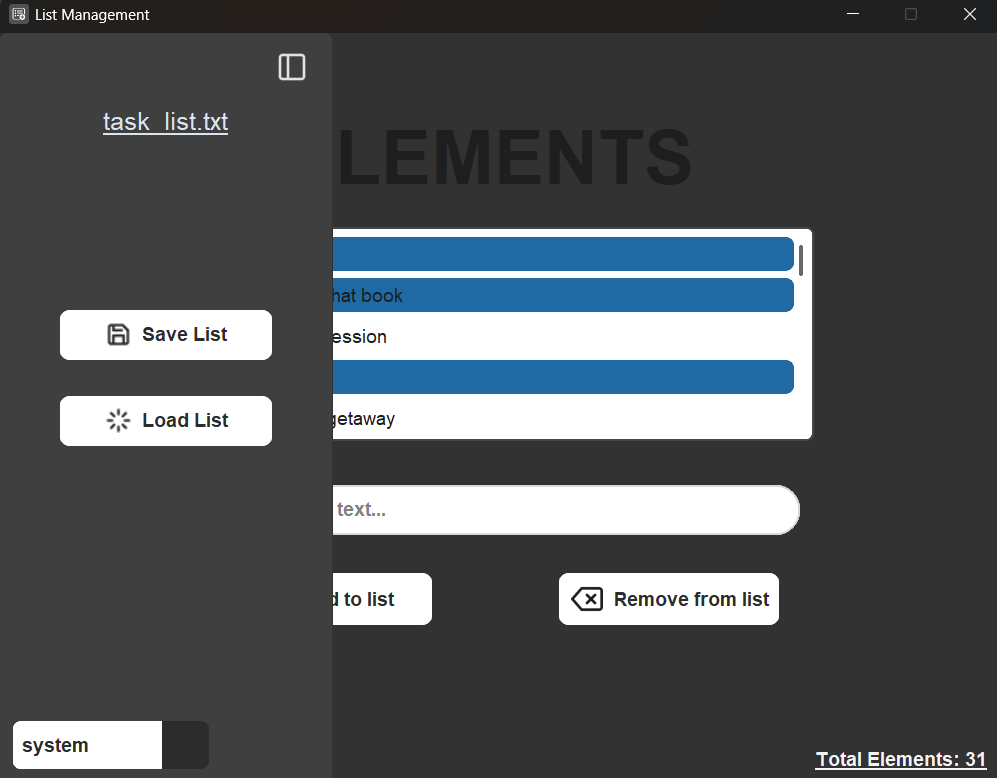
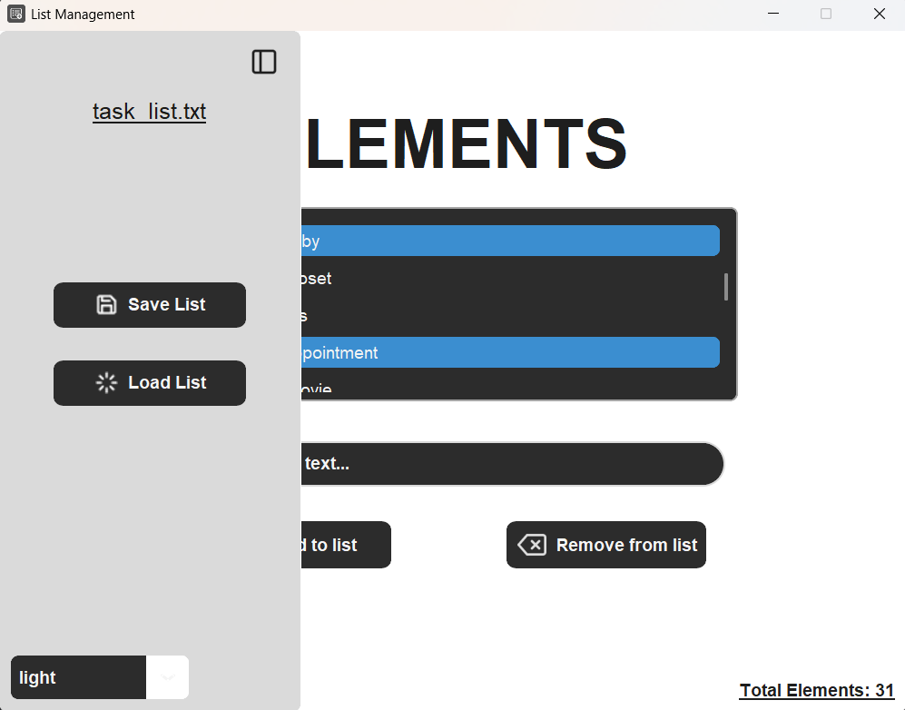
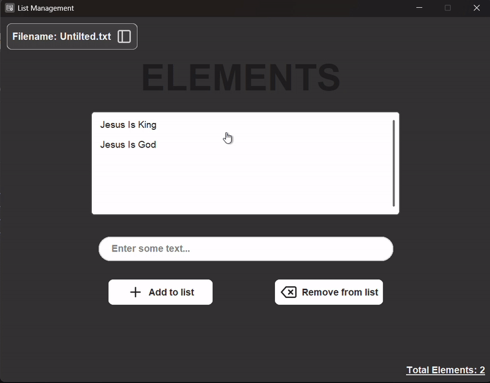

<h1 align="center" style="font-weight:bold">
Element List Manager (CTk HMI Project)
</h1>

[](LICENSE)
 


A lightweight, keyboard-friendly list management app built with **CustomTkinter (CTk)** for my HMI class.
Features full list editing, file persistence, focus-aware input handling, and dynamic theming (Light/Dark/System).

## **Features**

### List Management

* Add items using **Enter** or **Dedicated button**
* Remove selected items using **Delete** or again **Dedicated button**
* Scroll through items with **Up/Down Arrow Keys** or **Mousewheel**
* Wrap-around navigation (no dead-ends)
* Click to select (single or multiple), keyboard to navigate
* Single and Multiple elements deletion

### File Tools

* **Save** current list to a file
* **Load** an existing list
* Rename list files directly from the sidebar
* Automatic sync: renaming updates the sidebar button label too

### Theme Support

* **Light mode**
* **Dark mode**
* **System mode** (matches OS)
* Uses tuple-based color definitions for proper dual-theme design

### Focus-Aware Input

* Typing automatically focuses the entry field
* …unless the listbox already has focus
* Prevents accidental key events from going to the wrong widget

### UX Considerations

* Smooth keyboard workflow
* Clean layout using CTk widgets
* No blocking threads (`after` method used for background updates and checks)


### Background Save Check

The app includes a background method that continuously monitors whether any unsaved content exists. Upon attempting to quit the app, it will prompt the user to save their work if necessary.


## Screenshots

| Dark Mode                              | Light Mode                               |
|----------------------------------------|------------------------------------------|
|  |  |

| Dark Mode sidebar                              | Light Mode sidebar                               |
|------------------------------------------------|--------------------------------------------------|
|  |  |


## Automatic file rename sync (inspired by Figma's)
<p align="center">
  
</p>

## Installation


Clone the repo:

```bash
git clone https://github.com/gtRZync/element-list-manager.git
cd element-list-manager
```
Install required libraries:

```bash
pip install -r requirements.txt
```
Run:

```bash
python main.py
```

## 📄 License

MIT License 

---

## Future Improvements (Maybe)

* Drag & drop reordering
* Export as CSV or JSON
* Undo/redo stack

